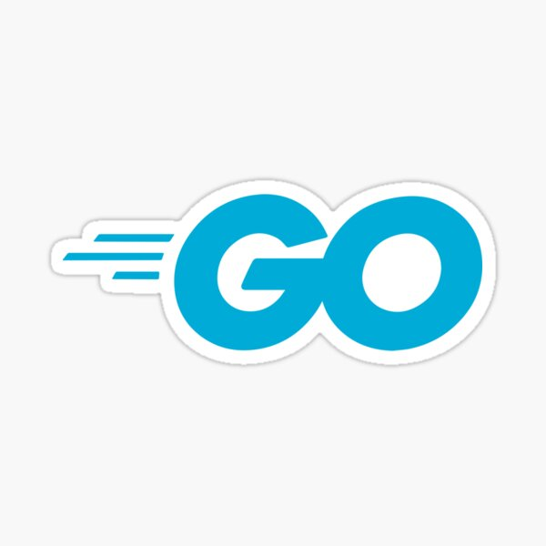
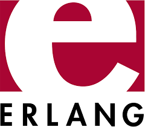

# 🌀 About Me:
## Hi there, I'm Benjamin 🧙
 -
🎓 I'm currently a freshman year __@KMUTT Computer Engineering__ student with a keen interest in __making Software products__ and __business development__.
 
 -
👨🏻‍💻 I have nearly a year of working experiences in __software testing__ at a tech company...
 
 -
🛠 I'm looking forward to develop my skills to become a ***Developer*** 😜 specialize in __Frontend Development, Data science & AI__ and also continuously learning new things.

## 🌐 Socials:
  
# 💻 Tech Stack:
       
# 💻 Tech I'd like to learn:
     

# 📊 Tech Stats:

---

<!-- Proudly created with GPRM ( https://gprm.itsvg.in ) --> 
